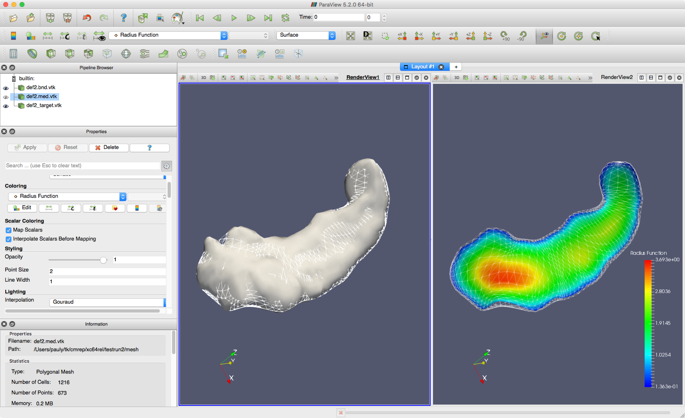
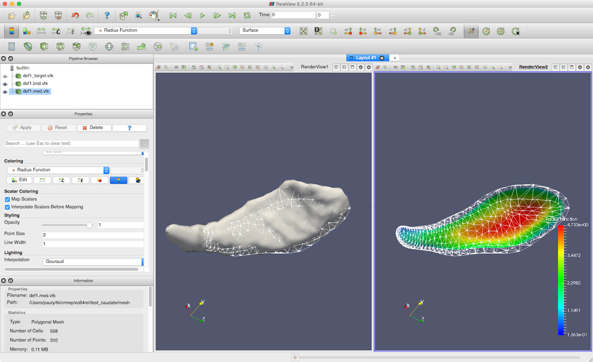

*****************
CM-Rep QuickStart
*****************

This page uses test data included with the cm-rep package to run simple examples. There are different sections for different cm-rep models. 

In all examples, we assume you are running in the directory where you compiled cm-rep and the source code directory is ``$CMREP_SRC``.

"Brute Force" CM-Rep Model
==========================

This model (circa 2006, used in 2008 NeuroImage tract-specific analysis paper) handles medial geometry constraints using soft penalties. It does not require any PDE solvers. It is also relatively fast.

This example will fit a cm-rep model of the hippocampus to a binary image::

    ./cmrep_fit $CMREP_SRC/testing/t001_param.txt \
      $CMREP_SRC/testing/t001_template_brute.cmrep \
      $CMREP_SRC/testing/t001_img_binary.nii.gz \
      test_brute
      
Fitting is done in four stages (align by moments, affine, coarse deformable, fine deformable). Output cm-rep models are in ``test_brute/cmrep`` and full-resolution medial and boundary meshes are in ``test_brute/mesh``. Below the fitting is visualized in ParaView.

   
PDE-Based CM-Rep Model
======================

This model from the 2008 NeuroImage paper uses the biharmonic PDE to implement cm-rep geometric constraints. To use it, you must enable ``PARDISO`` and have an up to date PARDISO license. 

This example will fit a cm-rep model of a caudate to a binary image::

    ./cmrep_fit $CMREP_SRC/testing/caudate_pde_param.txt \
      $CMREP_SRC/testing/caudate_pde_model.cmrep \
      $CMREP_SRC//testing/caudate_target.nii.gz \
      test_caudate

Fitting is done in two stages (align by moments, deformable). Output cm-rep models are in ``test_brute/cmrep`` and full-resolution medial and boundary meshes are in ``test_brute/mesh``. Below the fitting is visualized in ParaView.

   

